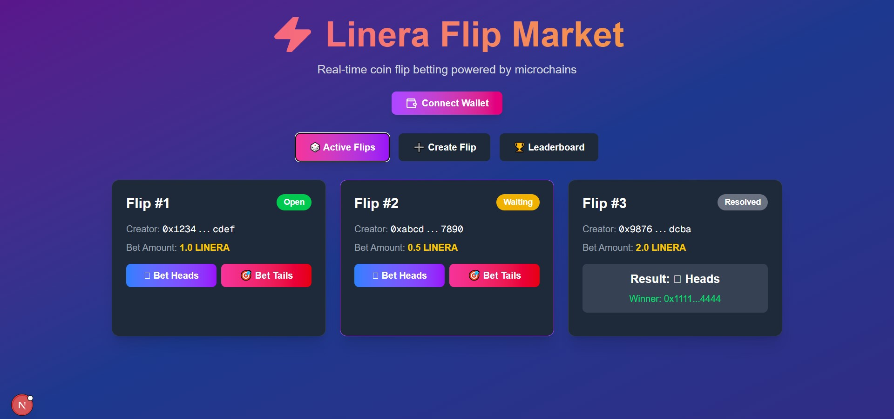
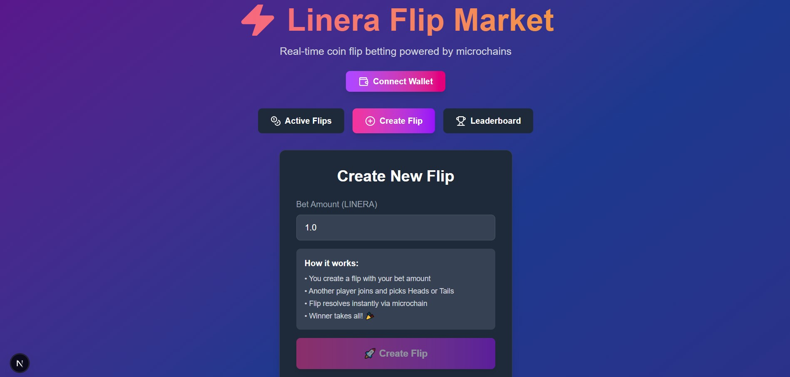
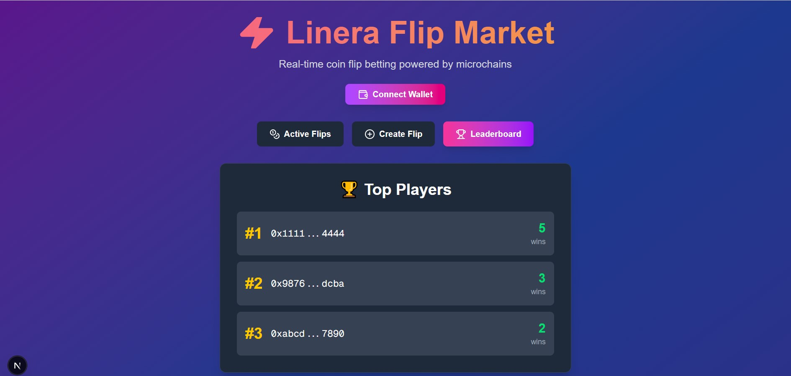

# ⚡ Linera Flip Market

> Real-time coin flip betting powered by Linera microchains

[](https://linera.io)
[](LICENSE)

## 🎯 Overview

Linera Flip Market is a decentralized coin flip betting platform that leverages Linera's microchain architecture for instant, transparent, and fair betting. Players can create coin flips, place bets, and see results resolved in real-time with zero latency.

## ✨ Features

- **🎲 Instant Coin Flips** - Create and join coin flip bets in seconds
- **⚡ Real-time Resolution** - Automatic flip resolution when second player joins
- **🏆 Leaderboard** - Track top players and their win streaks
- **💰 Transparent Betting** - All bets and results recorded on-chain
- **🔐 Secure & Fair** - Cryptographically secure randomness
- **📱 Modern UI** - Beautiful, responsive interface built with Next.js

## 🏗️ Architecture

### Smart Contract (Rust)
- **State Management** - Tracks all active flips and player stats
- **Betting Logic** - Handles flip creation, bet placement, and resolution
- **Leaderboard** - Maintains player rankings and win counts
- **GraphQL API** - Query flips and leaderboard data

### Frontend (Next.js + TypeScript)
- **React Components** - Modular, reusable UI components
- **TailwindCSS** - Modern, responsive styling
- **Real-time Updates** - Live flip status and leaderboard

## 📸 Screenshots

### Active Flips


### Create Flip


### Leaderboard


## 🚀 Quick Start

### Prerequisites
- Rust 1.70+
- Node.js 18+
- Linera CLI

### Install Linera CLI
```bash
git clone https://github.com/linera-io/linera-protocol.git -b testnet_conway
cd linera-protocol
cargo build --release -p linera-service
export PATH="$PWD/target/release:$PATH"
```

### Build Smart Contract
```bash
cd linera-flip-market
cargo build --release --target wasm32-unknown-unknown
```

### Deploy to Testnet
```bash
linera project publish-and-create
```

### Run Frontend
```bash
cd web
npm install
npm run dev
```

Open [http://localhost:3000](http://localhost:3000)

## 🎮 How to Play

1. **Create a Flip** - Set your bet amount and create a new flip
2. **Choose Side** - Pick Heads or Tails
3. **Wait for Opponent** - Another player joins and picks the opposite side
4. **Instant Resolution** - Flip resolves automatically, winner takes all!
5. **Climb Leaderboard** - Win more flips to reach the top

## 🛠️ Tech Stack

- **Blockchain**: Linera Protocol
- **Smart Contract**: Rust
- **Frontend**: Next.js 16, React, TypeScript
- **Styling**: TailwindCSS
- **GraphQL**: Async-GraphQL

## 📁 Project Structure

```
linera-flip-market/
├── src/
│   ├── lib.rs          # Core types and state
│   ├── contract.rs     # Smart contract logic
│   └── service.rs      # GraphQL API service
├── web/
│   ├── app/
│   │   └── page.tsx    # Main page
│   └── components/
│       ├── FlipCard.tsx
│       ├── CreateFlip.tsx
│       └── Leaderboard.tsx
├── screenshots/        # UI screenshots
├── Cargo.toml         # Rust dependencies
└── README.md
```

## 🎯 Linera Buildathon Wave 1

This project is submitted for the Linera Buildathon Wave 1 (October 2025).

### Why Linera?

- **Microchains** - Each flip can run on its own chain for maximum parallelism
- **Instant Finality** - No waiting for block confirmations
- **Low Latency** - Perfect for real-time betting applications
- **Scalability** - Handle thousands of concurrent flips

### Future Enhancements (Wave 2)

- 🎰 Multi-player tournaments
- 💎 NFT rewards for top players
- 🤖 AI opponent mode
- 📊 Advanced analytics dashboard
- 🌐 Cross-chain betting

## 📝 License

MIT License - see [LICENSE](LICENSE) file

## 🤝 Contributing

Contributions welcome! Please open an issue or PR.

## 📧 Contact

Built with ❤️ for the Linera Buildathon

---

**⚡ Powered by Linera Microchains**
