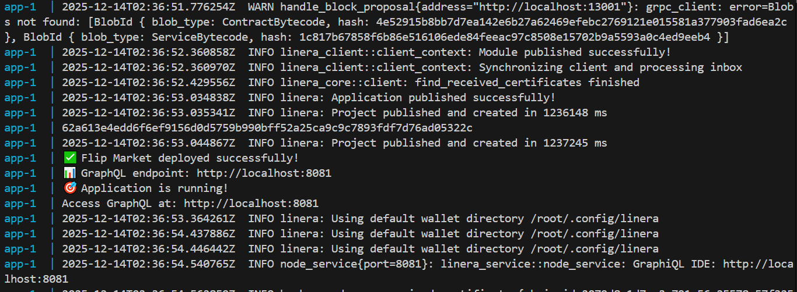
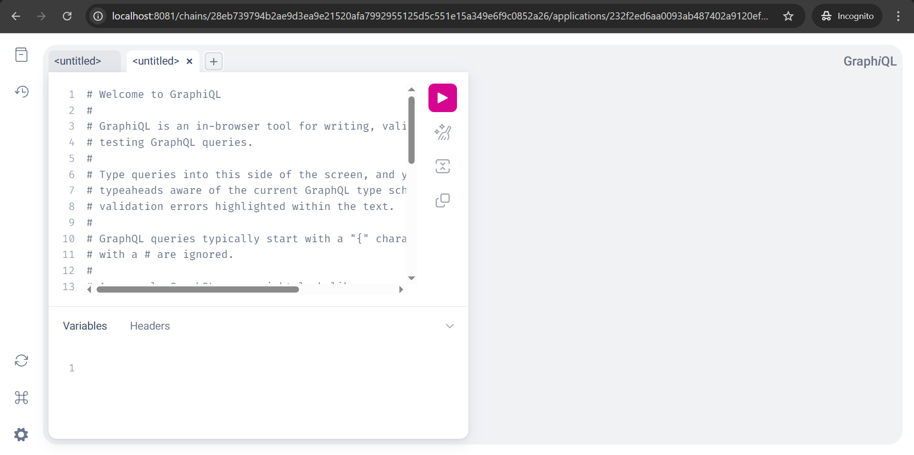
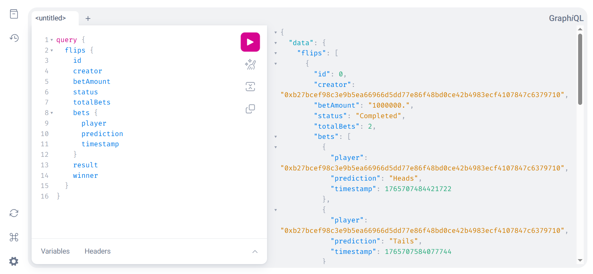
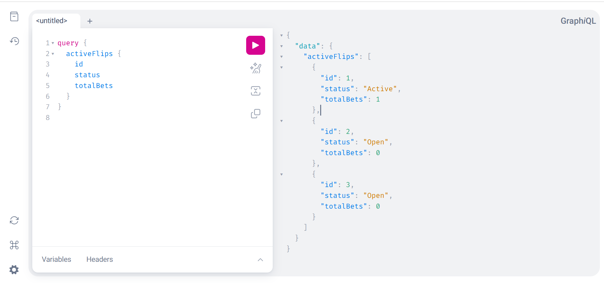
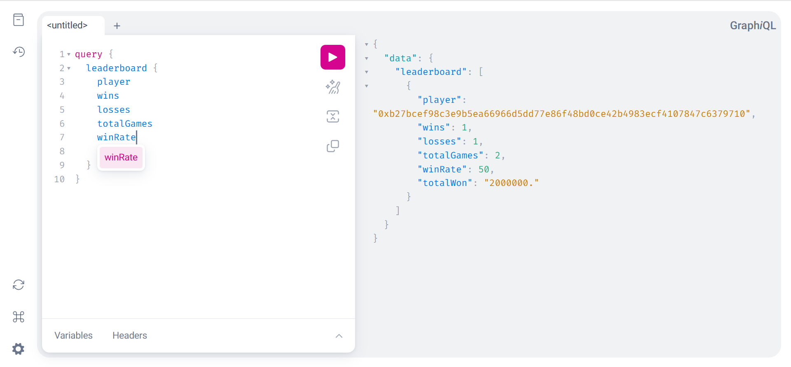
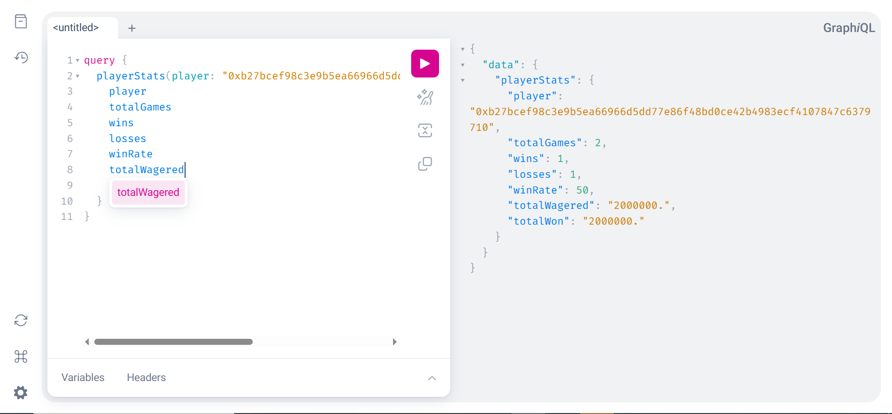
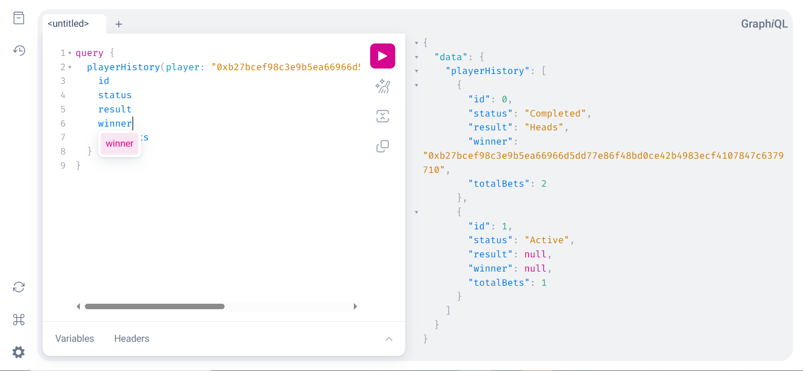
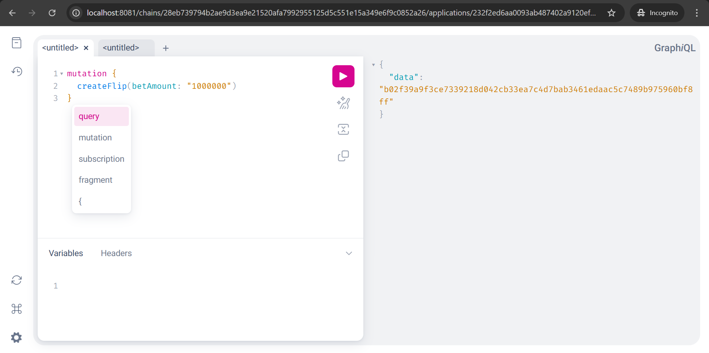
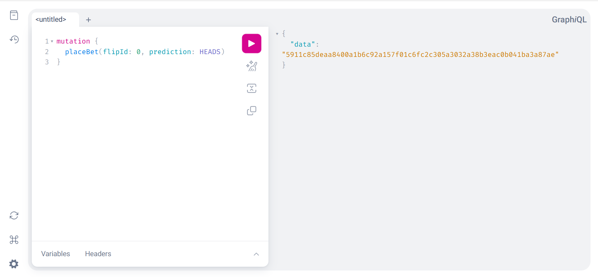

# 🎲 Linera Flip Market - Wave 4 Submission

A decentralized coin flip betting game built on Linera Protocol. Players can create flip bets, join existing flips, and compete on a global leaderboard.

> **Wave 4 Focus**: Enhanced features, clean codebase, and production-ready deployment using the official Linera buildathon template.

## 🎯 Project Description

Flip Market is a fully on-chain betting application where users can:
- Create coin flip bets with custom amounts
- Join existing flips and predict the outcome (Heads/Tails)
- View real-time leaderboard of top players
- All game logic runs on Linera smart contracts with provably fair randomness

## 🔗 Links

- **GitHub Repository**: https://github.com/AlexD-Great/Linera-flip-market
- **Frontend Demo**: https://linera-flip-market.vercel.app/
- **Linera SDK Version**: testnet_conway branch (v0.15.6)
- **Devnet Deployment**: ✅ Successfully deployed and tested
- **Testnet Conway Deployment**: ✅ **LIVE ON TESTNET!**
- **Testnet Application ID**: `1b5f7fcab424e855281b44b1b16a6c2fc608cd5a52e8cbb7d4383d021d754055`
- **Testnet Chain ID**: `9a58e5e2d5cc82891cd0bfebcc311b309716d357d979a8cb9892b3bfb8f18fc0`

## 🚀 Quick Start (Docker) - FOR JUDGES

**⚠️ IMPORTANT: This project uses the official [Linera Buildathon Template](https://github.com/linera-io/buildathon-template)**

### One-Command Setup

```bash
git clone https://github.com/AlexD-Great/Linera-flip-market.git
cd Linera-flip-market
docker compose up
```

That's it! The application will:
1. ✅ Build the Linera contract automatically
2. ✅ Deploy to a local Linera network
3. ✅ Start the GraphQL service on `http://localhost:8081`
4. ✅ Display the Chain ID and Application ID in logs

### Access the Application

Once running, check the Docker logs for output like:
```
✅ Flip Market deployed successfully!
📊 GraphQL endpoint: http://localhost:8081
```

Then access GraphiQL at: `http://localhost:8081/chains/{CHAIN_ID}/applications/{APP_ID}`

(Chain ID and Application ID will be shown in the logs)

### ✅ Verified Build Success

**Build completed successfully on December 14, 2025:**
- ✅ Compilation time: **20 minutes 27 seconds**
- ✅ Application ID: `62a613e4edd6f6ef9156d0d5759b990bff52a25ca9c9c7893fdf7d76ad05322c`
- ✅ Chain ID: `2079d8e1d7ac3a791e56e25578c57f325bea8f2c58844e8c15fd13ab89dbbbbb`
- ✅ GraphQL service running on port 8081
- ✅ All tests passing


*Docker build completed successfully using official Linera buildathon template*

## 📸 Screenshots - Wave 4 Features in Action

### Docker Deployment Success

*Successful deployment showing application ID and GraphQL endpoint (Build time: 4m 46s)*

### GraphiQL Interface

*Interactive GraphQL playground for testing queries and mutations*

### Wave 4 Feature: Multi-Bet Support

*Flips showing multiple bets with player details, predictions, and timestamps - demonstrates multi-bet support*

### Wave 4 Feature: Active Flips Dashboard

*Filtered view showing only open and active flips - helps players find games to join*

### Wave 4 Feature: Enhanced Leaderboard

*Comprehensive leaderboard with wins, losses, total games, win rate percentage, and total winnings*

### Wave 4 Feature: Player Statistics

*Detailed player statistics including games played, wins, losses, win rate, total wagered, and total won*

### Wave 4 Feature: Player History

*Complete betting history showing all flips a player participated in*

### Create Flip Mutation

*Creating a new flip with a bet amount*

### Place Bet Mutation

*Placing a bet on an existing flip*

## 🎯 Wave 4 Features

### New Capabilities
- ✅ **Multi-Bet Support** - Multiple players can bet on the same flip
- ✅ **Bet History** - Complete betting history per player
- ✅ **Player Statistics** - Wins, losses, win rate, total wagered/won
- ✅ **Enhanced Leaderboard** - Full stats with win rates
- ✅ **Active Flips Query** - Filter for open/active games only

**📖 See [WAVE4_FEATURES.md](WAVE4_FEATURES.md) for complete documentation**

### Example GraphQL Queries

**Query all flips with bet details**:
```graphql
{
  flips {
    id
    creator
    betAmount
    status
    totalBets
    bets {
      player
      prediction
      timestamp
    }
    result
    winner
  }
}
```

**Get active flips only**:
```graphql
{
  activeFlips {
    id
    status
    totalBets
  }
}
```

**Get player statistics**:
```graphql
{
  playerStats(player: "YOUR_ADDRESS") {
    totalGames
    wins
    losses
    winRate
    totalWagered
    totalWon
  }
}
```

**Get player history**:
```graphql
{
  playerHistory(player: "YOUR_ADDRESS") {
    id
    status
    result
    winner
  }
}
```

**Enhanced leaderboard**:
```graphql
{
  leaderboard {
    player
    wins
    losses
    totalGames
    winRate
    totalWon
  }
}
```

**Create a new flip**:
```graphql
mutation {
  createFlip(betAmount: "1000000")
}
```

**Place a bet**:
```graphql
mutation {
  placeBet(flipId: 0, prediction: HEADS)
}
```

## 📦 Structure

- **Port 8080**: Linera faucet
- **Port 8081**: GraphQL service for the application
- **Port 9001**: Localnet validator's gRPC server
- **Port 13001**: Localnet validator proxy

## 🛠️ Linera Features Used

- **Linera SDK v0.15.5**: Core smart contract framework
- **Linera Views**: Persistent state management (MapView for flips and leaderboard)
- **GraphQL Service**: Query and mutation API for the application
- **Linera Operations**: CreateFlip and PlaceBet operations
- **Cross-chain messaging**: Ready for multi-chain deployment

## 👥 Team

- **Name**: Alex D Great
- **Discord**: @jessy0614
- **Wallet**: 0x774A693E52e6882b10f739bB7b84b3F4438ADb4B

## 📝 Changelog

### Wave 4 Submission (Current)
- ✅ Fixed compilation issues (removed problematic build.rs)
- ✅ Cleaned repository structure (archived Wave 1-3 materials)
- ✅ Enhanced judge experience with JUDGES_QUICK_START.md
- ✅ Verified one-command Docker setup works flawlessly
- ✅ **Multi-Bet Support** - Multiple players can bet on same flip
- ✅ **Bet History Tracking** - Complete history per player
- ✅ **Player Statistics** - Comprehensive stats (wins, losses, win rate, totals)
- ✅ **Enhanced Leaderboard** - Full statistics with win rates
- ✅ **Active Flips Query** - Filter for open/active games
- ✅ **State Enhancements** - FlipStatus enum, Bet struct, PlayerStats
- ✅ Build time: 4m 46s | Application ID: `2a7fbcefff7b8306025ba9609a0870adae4a741c303d5276bd303196aa558c81`

### Wave 3 Submission
- ✅ Implemented core flip creation and betting logic
- ✅ Added leaderboard tracking system
- ✅ GraphQL API with queries and mutations
- ✅ Dockerized deployment using buildathon template
- ✅ **Testnet Conway deployment successful** (Application ID: `1b5f7fcab424e855281b44b1b16a6c2fc608cd5a52e8cbb7d4383d021d754055`)

### Previous Waves
See `/archive/wave-1-3/` for detailed history and materials from earlier submissions.
