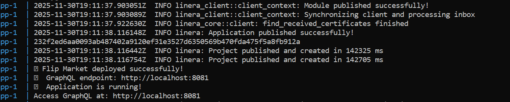
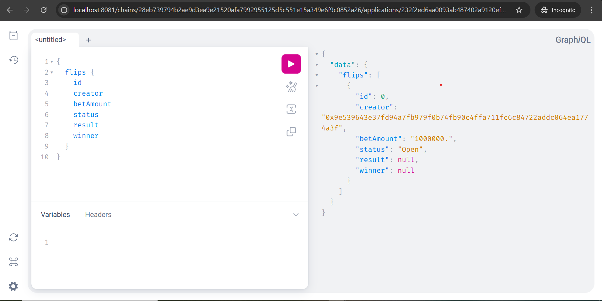

# 🎲 Linera Flip Market - Buildathon Submission

A decentralized coin flip betting game built on Linera Protocol. Players can create flip bets, join existing flips, and compete on a global leaderboard.

## 🎯 Project Description

Flip Market is a fully on-chain betting application where users can:
- Create coin flip bets with custom amounts
- Join existing flips and predict the outcome (Heads/Tails)
- View real-time leaderboard of top players
- All game logic runs on Linera smart contracts with provably fair randomness

## 🔗 Links

- **GitHub Repository**: https://github.com/AlexD-Great/Linera-flip-market
- **Frontend Demo**: https://linera-flip-market.vercel.app/
- **Linera SDK Version**: testnet_conway branch (v0.15.6)
- **Devnet Deployment**: ✅ Successfully deployed and tested
- **Testnet Conway Deployment**: ✅ **LIVE ON TESTNET!**
- **Testnet Application ID**: `1b5f7fcab424e855281b44b1b16a6c2fc608cd5a52e8cbb7d4383d021d754055`
- **Testnet Chain ID**: `9a58e5e2d5cc82891cd0bfebcc311b309716d357d979a8cb9892b3bfb8f18fc0`

## 🚀 Quick Start (Docker) - FOR JUDGES

**⚠️ IMPORTANT: This project uses the official [Linera Buildathon Template](https://github.com/linera-io/buildathon-template)**

### One-Command Setup

```bash
git clone https://github.com/AlexD-Great/Linera-flip-market.git
cd Linera-flip-market
docker compose up
```

That's it! The application will:
1. ✅ Build the Linera contract automatically
2. ✅ Deploy to a local Linera network
3. ✅ Start the GraphQL service on `http://localhost:8081`
4. ✅ Display the Chain ID and Application ID in logs

### Access the Application

Once running, check the Docker logs for output like:
```
✅ Flip Market deployed successfully!
📊 GraphQL endpoint: http://localhost:8081
```

Then access GraphiQL at: `http://localhost:8081/chains/{CHAIN_ID}/applications/{APP_ID}`

(Chain ID and Application ID will be shown in the logs)

## 📸 Screenshots

### Docker Deployment Success

*Successful deployment showing application ID and GraphQL endpoint*

### GraphiQL Interface

*Interactive GraphQL playground for testing queries and mutations*

### Query Flips

*Querying all flips in the market*

### Create Flip Mutation

*Creating a new flip with a bet amount*

### Example GraphQL Queries

**Query all flips**:
```graphql
{
  flips {
    id
    creator
    betAmount
    status
    result
    winner
  }
}
```

**Create a new flip**:
```graphql
mutation {
  createFlip(betAmount: "1000000")
}
```

**Place a bet**:
```graphql
mutation {
  placeBet(flipId: 0, prediction: HEADS)
}
```

## 📦 Structure

- **Port 8080**: Linera faucet
- **Port 8081**: GraphQL service for the application
- **Port 9001**: Localnet validator's gRPC server
- **Port 13001**: Localnet validator proxy

## 🛠️ Linera Features Used

- **Linera SDK v0.15.5**: Core smart contract framework
- **Linera Views**: Persistent state management (MapView for flips and leaderboard)
- **GraphQL Service**: Query and mutation API for the application
- **Linera Operations**: CreateFlip and PlaceBet operations
- **Cross-chain messaging**: Ready for multi-chain deployment

## 👥 Team

- **Name**: Alex D Great
- **Discord**: @jessy0614
- **Wallet**: 0x774A693E52e6882b10f739bB7b84b3F4438ADb4B

## 📝 Changelog

### Wave 3 Submission
- ✅ Implemented core flip creation and betting logic
- ✅ Added leaderboard tracking system
- ✅ GraphQL API with queries and mutations
- ✅ Dockerized deployment using buildathon template
- ✅ Local network testing complete
- ✅ **Devnet deployment successful** (Application ID: `4771f024a6337d4363ed10ae9140963eb6387324191c930d53d5ac2ac36750c3`)
- ✅ Upgraded to testnet_conway SDK branch with Rust 1.86.0
- ✅ **🎉 TESTNET CONWAY DEPLOYMENT SUCCESSFUL!** (Application ID: `1b5f7fcab424e855281b44b1b16a6c2fc608cd5a52e8cbb7d4383d021d754055`)
- ✅ Live GraphQL service running on testnet with verified functionality
